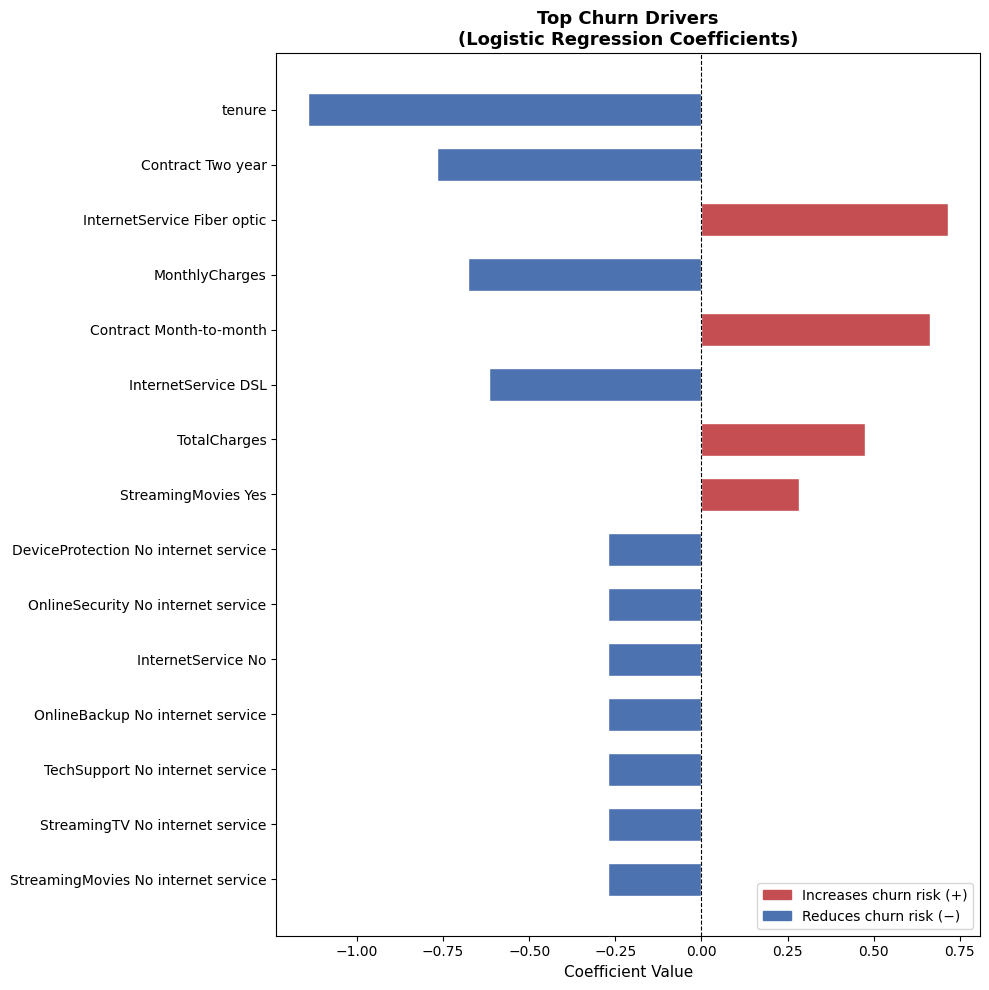

# Customer Churn Prediction using Scikit-Learn Pipelines

This project predicts whether a telecom customer will churn using historical customer data.

The goal is to identify customers likely to leave so businesses can take retention actions.

---

## Problem Type

Binary Classification

Target variable:

Churn  
0 → Customer stays  
1 → Customer leaves

---

## Dataset

Telco Customer Churn Dataset

Contains customer information such as:

- tenure
- contract type
- monthly charges
- internet services
- payment methods

---

## Project Workflow

1. Data Loading & Inspection
2. Data Cleaning
3. Exploratory Data Analysis (EDA)
4. Feature Encoding
5. Train/Test Split
6. Model Training (with sklearn Pipeline)
7. Cross Validation
8. Hyperparameter Tuning (GridSearchCV)
9. Final Evaluation + Feature Importance

---

## ML Pipeline

The model is trained using a Scikit-Learn Pipeline to ensure consistent preprocessing and avoid data leakage.

Pipeline steps:

1. Numeric features → StandardScaler
2. Categorical features → OneHotEncoder
3. Model → Logistic Regression

This ensures preprocessing occurs inside cross-validation and hyperparameter tuning.

--- 

## Cross Validation

5-fold cross validation was used to verify model stability.

Mean Recall: 0.75  
Standard Deviation: 0.007

Low variance indicates the model performs consistently across different data splits.

---

## Models Used

### Logistic Regression
Baseline interpretable model.

### Balanced Logistic Regression

Handled class imbalance using:
class_weight='balanced'

---

## Model Performance

| Metric | Score |
|--------|-------|
| Accuracy | 0.74 |
| Precision | 0.50 |
| Recall (Churn) | **0.78** |
| F1 Score | 0.61 |

---

## Key Insight

Balanced Logistic Regression significantly improved **recall for churn customers**.

Recall increased from **0.56 → 0.78**, meaning the model detects more customers likely to leave.

This is important because missing churn customers can directly impact revenue.

---
## Feature Importance

The logistic regression coefficients show which factors increase or decrease the likelihood of customer churn.

Red bars indicate factors that increase churn risk, while blue bars reduce churn risk.



### Top Churn Drivers (from coefficients)

| Factor | Effect |
|--------|--------|
| Month-to-month contract | Increases churn risk |
| Fiber optic internet | Increases churn risk |
| Long tenure | Reduces churn risk |
| Two-year contract | Reduces churn risk |

---

## Tools Used

- Python
- Pandas
- NumPy
- Seaborn / Matplotlib
- Scikit-learn

---

## Project Structure
```
customer-churn-ml/
│
├── dataset/
│   └── Telco-Customer-Churn.csv
│
├── notebook/
│   └── churn_analysis.ipynb
│
├── requirements.txt
│
├── .gitignore
│
└── README.md
```

---

## How to Run

Clone the repository

git clone https://github.com/codewith-krishh/customer-churn-ml.git

Install dependencies

pip install -r requirements.txt

Run the notebook

notebook/churn_analysis.ipynb

---

## Author
Created by: **Krish**
Machine Learning Projects Portfolio